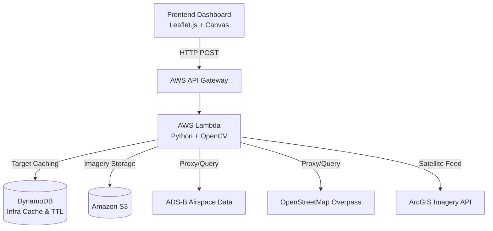

<div align="center">
  
  <h1>Overwatch GEOINT</h1>
  <p><strong>Serverless Geospatial Intelligence & Open Source Intelligence (OSINT) Platform</strong></p>

  <p>
    <a href="https://github.com/Hossam77i/overwatch-geoint/actions/workflows/deploy.yml">
      
    </a>
    <a href="https://www.python.org/downloads/release/python-3110/">
      
    </a>
    <a href="https://aws.amazon.com/lambda/">
      
    </a>
    <a href="https://www.terraform.io/">
      
    </a>
    <a href="LICENSE">
      
    </a>
  </p>
  
  <p>
    <a href="#architecture">Architecture</a> •
    <a href="#features">Features</a> •
    <a href="#quick-start">Quick Start</a> •
    <a href="#devsecops-workflow">DevSecOps</a> •
    <a href="#contributing">Contributing</a>
  </p>
</div>

---

## Overview

**Overwatch GEOINT** is a highly scalable, event-driven tactical intelligence dashboard. It is capable of parsing global geospatial data in real-time, executing Computer Vision (CV) tracking models against satellite imagery, and maintaining extreme low-latency tracking of global infrastructure without relying on expensive, always-on servers.

Built strictly on **Serverless AWS** principles, it bridges the gap between heavy computer vision workloads and ephemeral serverless compute functions.

## 🏗 Architecture

The system utilizes an advanced event-driven architecture defined via Terraform Infrastructure-as-Code (IaC).



##  Features

- **Computer Vision Macros:** Automated OpenCV morphological detection for Maritime, Aviation, and Ground Armor signatures utilizing non-maximum suppression (NMS) algorithms.
- **Real-Time Airspace Tracking:** Live ADS-B transponder data streams intercept and track global aviation assets in real-time.
- **100% Serverless:** Pay-per-use architecture running on AWS Lambda, scaling instantly from 0 to 1,000+ concurrent scans.
- **Threat Intelligence Logging:** Rolling 48-hour incident response tracker using DynamoDB Time-To-Live (TTL) and secure GeoIP HTTPS resolution.
- **Tactical UI:** High-performance, Canvas-accelerated Leaflet.js dashboard built for complex geographical rendering without DOM lagging.

## Quick Start

### Prerequisites
- [Docker](https://docs.docker.com/get-docker/) & [AWS CLI](https://aws.amazon.com/cli/)
- [Terraform](https://www.terraform.io/downloads.html) >= 1.5.0
- Python 3.11+

### Local Setup
```bash
# 1. Clone the repository
git clone https://github.com/Hossam77i/overwatch-geoint.git
cd overwatch-geoint

# 2. Configure Python Virtual Environment
python3 -m venv venv
source venv/bin/activate
pip install -r requirements.txt

# 3. Run the Core Test Suite
pytest tests/
```

### Infrastructure Deployment
```bash
cd terraform
terraform init
terraform plan
terraform apply -auto-approve
```

## DevSecOps Workflow

This repository strictly enforces professional DevSecOps standards via GitHub Actions:
- **Trivy:** Static container vulnerability scanning against the Lambda ECR image.
- **Bandit:** SAST (Static Application Security Testing) to prevent secrets leakage.
- **Flake8 & Black:** Strict PEP-8 code style enforcement and complexity bounds.
- **Pytest:** Mapped and mocked integration testing for CV logic.
- **Terraform:** Infrastructure configuration and permission boundaries dynamically deployed via CI/CD.

## Contributing

We welcome contributions from the Open Source Intelligence (OSINT) and DevSecOps community! Please read our [Contributing Guidelines](CONTRIBUTING.md) and [Code of Conduct](CODE_OF_CONDUCT.md) before submitting Pull Requests.

## License

This project is licensed under the MIT License - see the [LICENSE](LICENSE) file for details.
